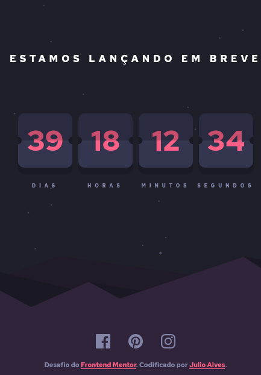

# Frontend Mentor - Launch countdown timer

Esta é uma solução para o desafio [Launch countdown timer](https://www.frontendmentor.io/challenges/launch-countdown-timer-N0XkGfyz-) Os desafios do Frontend Mentor ajudam você a melhorar suas habilidades de codificação ao construir projetos realistas.

## Índice

- [Visão geral](#visão-geral)
  - [O desafio](#o-desafio)
  - [Screenshot](#screenshot)
  - [Links](#links)
- [Processo](#processo)
  - [Construído com](#construído-com)
- [Autor](#autor)

## Visão geral

### O desafio

Os usuários devem ser capazes de:

- Veja os estados de foco para todos os elementos interativos na página
- Veja uma contagem regressiva ao vivo que diminui a cada segundo
- Bônus: quando um número muda, vire a carta do meio

### Screenshot

### Links

- URL do site ao vivo: [Link](https://julioalves-dev.github.io/launch-countdown-timer-main/)

## Processo

### Construído com

- HTML5
- CSS3
- JavaScript

## Autor

- Frontend Mentor - [@JulioAlves-Dev](https://www.frontendmentor.io/profile/JulioAlves-Dev)
- Twitter - [@JulioAlv35](https://twitter.com/JulioAlv35)
- Linkedin - [Julio Alves](https://www.linkedin.com/in/julio-alves-0119b01a6/)
